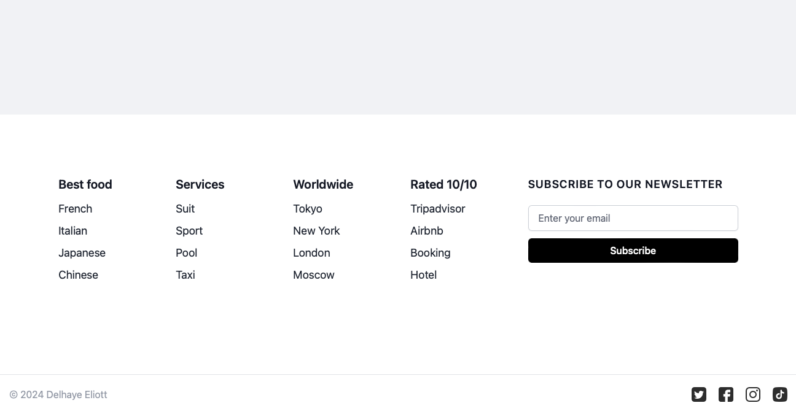
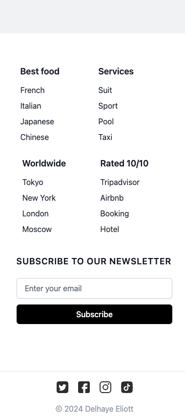

# TailwindCSS-Component: Footer

This repository contains a simple, responsive footer component designed for e-commerce websites using TailwindCSS. 
The footer includes categorized links and a newsletter subscription form, optimized for both desktop and mobile layouts. 
This component utilizes TailwindCSS via Play CDN, so no installation is necessary.

## Features

- Responsive design that adapts to desktop and mobile screens.
- Categorized links for easy navigation.
- Newsletter subscription section.
- Uses TailwindCSS Play CDN for instant use without the need to install TailwindCSS locally.

## Preview

Desktop view:



Mobile view:



## Usage

To use this component in your project, simply copy the HTML code from the `footer.html` file into your project. Make sure to include the TailwindCSS Play CDN link in your HTML if it isn't already there.

```html
<!-- Include this in your <head> section -->
<link href="https://cdn.tailwindcss.com" rel="stylesheet">
```

## Access

Access the live version of the footer component here: eliottdelhaye.github.io/TailwindCSS-Component-Footer/
